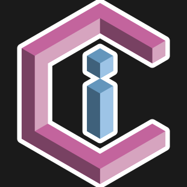

<!-- markdownlint-disable MD033 -->
<h1> C++ Image Converter</h1>
<!-- markdownlint-enable MD033 -->

Browser microapp that converts **between C/C++ image arrays and SVG**. Neighbouring same-colour pixels are merged into larger rectangles for easier editing. Runs entirely client-side — suitable for GitHub Pages.

App link: [filcuk.github.io/cpp-image-converter](https://filcuk.github.io/cpp-image-converter/)


## Features

- **C → SVG** — paste or upload `.c` / `.h` / `.txt`, preview, download `.svg`
- **SVG → C** — paste or upload `.svg` (including path-based artwork); download a Piskel-like `.c` array (including indexed I1–I8 with palette)
- **C → C** — convert between C array types (e.g. `uint32_t` ARGB32 → `uint16_t` RGB565 or indexed `uint8_t`) and/or resize, without going through SVG
- **Pixel formats** — Auto-detect from element type, or pick manually (grouped in the UI by use):
  - True colour — ARGB32 (LE RGBA / `0xAABBGGRR`), classic AARRGGBB, XRGB8888, RGB888 / BGR888
  - 16-bit colour (TFT / LCD) — RGB565 (TFT), byte-swapped RGB565, RGB565A8, ARGB8565
  - Black & white / e-ink — 1-bit (B/W)
  - Grayscale — L8 / AL88, packed 2/4-bit
  - Indexed / palette — I1–I8 (palette from `*_color` / `*_palette` when present)
- **Multi-frame** — frame picker, or **Animate frames** (+ FPS) in every direction (SMIL SVG out, or multi-frame C arrays with animated preview)
- **Options** — input width/height (when not in source defines), output scale, override fill, minimised SVG, array name

### Format notes

- Auto-detection can identify non-indexed `uint8_t` streams from dimensions and byte count. A three-byte stream could be RGB888, BGR888, RGB565A8, or ARGB8565, so Auto selects RGB888 and warns; choose the format manually when the channel layout matters.
- RGB565A8 uses the LVGL layout: all little-endian RGB565 colour bytes followed by the alpha-byte plane. ARGB8565 uses one alpha byte followed by little-endian RGB565 bytes per pixel.
- Palette entries use the Piskel-compatible little-endian RGBA word format `0xAABBGGRR`, the same representation used by ARGB32 (LE RGBA).
- Common storage/attribute tokens such as `PROGMEM`, `LV_ATTRIBUTE_*`, and `__attribute__((...))` are ignored around supported typed array declarations. Complex preprocessor-generated declarations may still require a plain declaration.

## Quick start

```bash
npm ci
npm run lint
npm test
npx serve .
```

## Documentation

| Guide | Contents |
| ----- | -------- |
| **[USAGE.md](USAGE.md)** | Design system, project layout, local preview, GitHub Pages, and component catalogue |
| **[AGENTS.md](AGENTS.md)** | Rules for AI assistants working in this repo |
| **[DISCLAIMER.md](DISCLAIMER.md)** | LLM assistance notice |

## Stack

- Plain HTML, CSS custom properties, and ES modules
- Light / dark / system theme with flash-free `theme-init.js`
- Shared page chrome (footer, theme toggle, page nav) via `initShell()`
- Deployed with GitHub Actions to GitHub Pages

## License

MIT - see [LICENSE](LICENSE).
